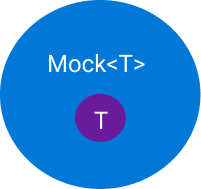

# Substituindo as dependências dos objetos com Moq

## Por que eu preciso de um dublê?
Quando desenvolvemos testes de unidade, é comum termos que trabalhar com objetos complexos, que contenham dependências, ou que se comportam como se estivessem em produção, como, por exemplo, uma consulta em um banco de dados ou uma integração com APIs. Esses comportamentos, porém, deixam nossos testes complexos, dependentes e lentos, tornando, assim, o teste inviável. Para resolver esses problemas usamos dublês, que são objetos que apenas substituem, simulando, os objetos de produção. 

Ou seja, quando queremos testar um comportamento de uma classe que contenha dependencia e queremos apenas simular um suposto comportamento de uma dependencia, então, usmaos dublês. Essa prtática permite a simulação de casos em que a dependencia retorne a resposta esperada, sem chance de falha por causa do ambiente de produção, ou de falha da resposta, sem que eu tenha que alterar nenhuma linha da feature em produção para simular estes casos.

Existem vários tipos de dublês:

- Fakes:  
    Fakes são objetos que escrevemos com retornos fixo, são os mais trabalhosos de implementar e menos reutilizaveis, por isso são pouco utilizados na prática.  

- Stubs:  
    Stubs são objetos com dados pré definidos, prontos para serem retornados. Ideal para interações com bancos de dados.  

- Mocks:  
    Mocks são objetos moldados, podem ser coonfigurados para se comportarem como os objetos de produção, eles nos oferecem um ferramental a mais para analisarmos como eles se comportam.

Fakes e stubs são metodos mais academicos, e é pela facilidade do uso e pelo ferramental mais elaborado, que vamos focar em estudar os mocks e, no nosso caso, na ferramenta Moq.

## Entendendo os Mocks

Mocks são objetos que envolvem uma interface, criando configurações para o comportamento da mesma. 
É possivel, com mocks, configurar o que um método de uma interface irá retornar, ou se dado um parametro X este metodo deve lançar uma exceção. 
Podemos. também, verificar se o método foi chamado ou até quantas vezes o método foi chamado.

O Mock é responsável por receber e retornar configurações do comportamento de um objeto interno, criado automaticamente e já implementando a interface que passamos por parametro T. Assim, se eu configurar um método da interface para responder sempre uma resposta X, quando o metodo que estou testando chamar este metodo, o resultado será igual a X.

## O Moq

O Moq é uma biblioteca...

Para instanciar um novo mock, basta chamar o construtor, passando por parametro (de tipo genérico) a interface que você deseja simular.

    var fooMock = new Mock<IFoo>();

É importante lembrar que o Mock em si não implementa a interface passada por parametro. Em sua estrutura, o mock possui uma propriedade publica chamada de Object, que é usada como output do mock, e essa sim implementando a interface. Então quando formos utilizar o mock para uma ação, o código fica assim:  

    // bar é o objeto que estamos testando, este método, por exemplo, depende de foo para ser executado.
    bar.doSomethingWithFoo(fooMock.Object);

#### Os Métodos de Configuração

#### Os Métodos de Verificacão

## Referências

1. Test Doubles — Fakes, Mocks and Stubs - Michal Lipski  
https://blog.pragmatists.com/test-doubles-fakes-mocks-and-stubs-1a7491dfa3da - Acessado em 10/06/2019

2. Testes Unitários 101: Mocks, Stubs, Spies e todas essas palavras difíceis - Lucas Santos  
https://medium.com/trainingcenter/testes-unit%C3%A1rios-mocks-stubs-spies-e-todas-essas-palavras-dif%C3%ADceis-f2765ac87cc8 - Acessado em 10/06/2019

3. Video: Unit Testing: MOQ Framework - Microsoft Visual Studio: Robert Green e Phil Japikse  
   https://www.youtube.com/watch?v=dZ2Psa_Bn2Q - Acessado em 05/07/2019

---
Autor: Henrique Felipe Urruth  
Data: 04/06/2019